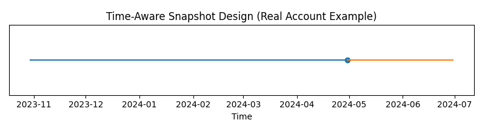
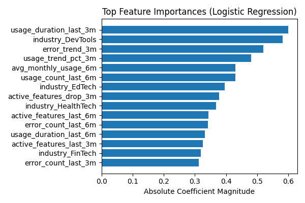

# Time-Aware Churn Modeling on a Real-World SaaS Dataset

## Project Overview

**Dataset Link:** https://www.kaggle.com/datasets/rivalytics/saas-subscription-and-churn-analytics-dataset

I started this project with a clear and standard applied machine learning goal: build a time-aware churn prediction system for a SaaS product using a realistic, multi-table dataset. The intent was not to chase high accuracy or leaderboard-style metrics, but to build the system correctly, in a way that would resemble how churn modeling is done in real production environments.

From the beginning, I enforced the following constraints:
* No data leakage
* No random train-test splits
* No unrealistic feature access
* No shortcut or post-hoc features
* Strict time awareness across the entire pipeline

This project ultimately became a rigorous investigation into the limits of churn predictability when only behavioral telemetry is available.

## Dataset Description

The dataset represents a realistic SaaS analytics setup with multiple interconnected tables, including:
* Accounts (business metadata)
* Subscriptions (contract-level information)
* Feature usage logs
* Support / error signals
* Churn events

**Key dataset properties:**
* Monthly time granularity
* Multiple subscriptions per account
* Overall churn rate ≈ 11–12%
* No explicit renewal decision signals
* No pricing, discounting, or negotiation data

These properties turned out to be critical in determining what could and could not be modeled.

## Original Problem Statement

The original modeling objective was defined as: Predict whether an account will churn within the next 2 months, given its historical behavior and lifecycle context. This framing mirrors common SaaS use cases where churn interventions must happen before contract termination.

## Time-Aware Snapshot Design

### Account × Month Backbone
I constructed a monthly account × snapshot_date backbone where:
* Each row represents the full system state of an account at a given month
* Features are computed strictly using information available up to that month
* Future information is never visible to past snapshots

This ensured full temporal correctness across the dataset.

### Label Engineering
Churn labels were defined using a forward-looking window: $label = 1$ if churn occurs within the next 2 months. This approach ensured realistic operational framing, consistent labeling across accounts, and no leakage from future churn events.

## Feature Engineering (Leakage-Safe)

All features were engineered using only past data relative to each snapshot.

**Behavioral Features**
* Rolling usage counts (1m / 3m / 6m)
* Rolling usage duration
* Error counts
* Number of active features

**Trend Features**
* Short-term usage slopes
* Percentage change in usage and engagement

**Lifecycle Features**
* Account age (days)
* Months since first usage
* Months since last usage
* Average monthly usage over historical windows

**Static Business Features**
* Plan tier
* Industry
* Country
* Number of seats
* Trial indicator

Every feature was explicitly validated to avoid temporal leakage.

## Model Training and Evaluation Setup

### Train / Validation Split
I used a strict time-based split with no random shuffling. The validation period strictly occurs after the training period.

### Evaluation Metrics
Because churn is an imbalanced problem, I avoided accuracy-based metrics and used:
* ROC-AUC (ranking sanity check)
* PR-AUC (precision–recall tradeoff)
* Lift@Top10% (business-relevant metric)

## Baseline Results

Initial baseline (logistic regression) performance:
* ROC-AUC ≈ 0.50
* PR-AUC ≈ 0.15
* Lift@Top10% ≈ 1.3×

This indicated weak global separability and limited concentration of churners at the top of the risk ranking.

## Lifecycle-Based Analysis

To understand where churn might be predictable, I evaluated performance by lifecycle segments.

**Churn Timing Insight**
I observed that ~54% of churn occurs within the first 6 months. However, even within early lifecycle cohorts, Lift@Top10% remained ≈ 1.3× and high-risk accounts were not sharply isolatable.

**Performance by Account Age**
* 0–3 months: ROC ≈ 0.55
* 3–12 months: ROC ≈ 0.50
* 1–2 years: ROC < 0.48

This suggested that predictability decreases as accounts mature.

## Event-Driven Churn Hypothesis

I hypothesized that churn might be event-driven rather than gradual. To test this, I engineered explicit shock indicators including zero-usage flags, sharp usage drop indicators, feature abandonment flags, error spikes, and early inactivity signals.

**Result:** No meaningful improvement in Lift or ranking quality. This indicated that observable behavioral shocks were not reliable churn triggers in this dataset.

## Account-Relative Normalization

Next, I tested whether churn was driven by relative deviation from an account’s own historical baseline, rather than absolute behavior. I added leakage-safe, per-account deviation features such as rolling historical means and standard deviations (shifted) and Z-score–style deviation metrics.

**Result:** No improvement. Lift remained unchanged. This suggested that churn decisions were not preceded by detectable behavioral deviation.

## Structural Feasibility Filtering

I then tested whether many rows represented states where churn was structurally unlikely. During training only, I removed rows where the account was mature, the account was recently active, or no behavioral shock indicators were present. Validation data was left untouched.

**Result:** Training data collapsed significantly, model performance degraded further, and Lift dropped close to random. This confirmed that the already weak signal was not localized to feasible churn windows.

## Time-Aware Snapshot Design

### Account × Month Backbone
I constructed a monthly account × snapshot_date backbone.

* Each row represents the full system state of an account...
...

## Baseline Results

Initial baseline (logistic regression) performance:
* ROC-AUC ≈ 0.50
* PR-AUC ≈ 0.15

This indicated weak global separability and limited concentration of churners at the top of the risk ranking. Even with more complex models, the inability to push the PR curve upward confirmed that the features lacked the signal necessary to reliably identify high-risk accounts.

After systematically exhausting all legitimate modeling levers... I concluded that churn decisions are driven by unobserved factors.
## Final Conclusion

After systematically exhausting all legitimate modeling levers—lifecycle segmentation, event detection, account-relative normalization, structural feasibility filtering, and strict temporal validation—I concluded that churn decisions in this dataset are primarily driven by unobserved exogenous factors, such as:
* Contract renewal negotiations
* Budget changes
* Strategic or organizational decisions

These drivers are not observable in behavioral telemetry, which fundamentally limits predictability. This outcome reflects a data observability limitation, not a modeling failure.

## Note on Model Performance and Final Conclusion

During the later stage of this project, I retrained a baseline logistic regression model using a standard **70% train / 30% validation temporal split**, without applying additional structural filtering.

With this setup:
- ROC-AUC increased to ~0.61
- PR-AUC increased to ~0.28 (base churn rate ~0.12)

This improvement confirmed that the model was able to learn **coarse lifecycle signals**, such as account age and inactivity, especially for later-stage churn. In other words, churn becomes more separable when the model is allowed to use broader lifecycle hindsight.

However, this result did **not change the original conclusion of the project**.

When the problem was framed more realistically — focusing on early churn, strict leakage-safe windows, and intervention-ready settings — the predictive signal consistently weakened. This indicated that while churn can be detected retrospectively, it is much harder to predict **early enough to act on** using behavioral telemetry alone.

I treated this increase in ROC as a validation of the data boundary rather than a reason to continue optimizing models. Pushing further would likely improve metrics marginally, but would not improve real-world actionability.

For this reason, I consider this project complete and use it as a learning reference for problem framing, evaluation discipline, and knowing when to stop modeling.
## Why I Stopped Modeling

Continuing beyond this point would have meant metric pushing, adding unjustified complexity, or masking weak signal with model tuning. 

## What This Project Demonstrates

Although I chose not to include this project on my résumé, it demonstrates:
* Correct time-aware ML system design
* Strict leakage prevention
* Proper metric selection for imbalanced problems
* Hypothesis-driven iteration
* Knowing when to stop modeling

These are critical skills in real-world applied machine learning.

## Closing Notes

This project served as a real-world calibration exercise. Synthetic data behaved cleanly, but real data resisted assumptions. Correct ML led to honest conclusions rather than inflated metrics. The primary lesson I take forward is simple: test predictability early, before committing to a full modeling pipeline. That lesson alone made this project worthwhile.
Please feel free to use this repo for any new experiments, leanings, etc.
